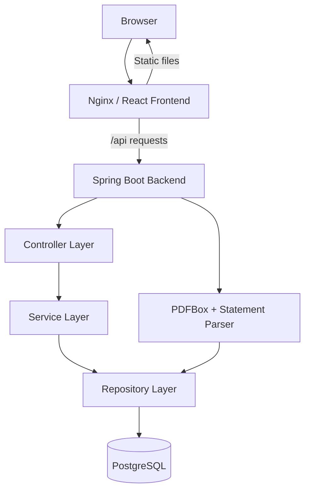

Wed, Jul 1 at 8:47 PM

Pasted text.txt
Document
I wanted to continue a chat session from another chat in this project, this is the summary from there, currently i fixed the final router setup issue : 

Fri, Jul 3 at 11:55 PM
Generated image: Sleek finance dashboard overview


Edit


Sunday 6:24 PM
Generated image: Modern finance dashboard UI mockup


Edit


Tuesday 5:07 PM
Generated image: Futuristic finance dashboard UI mockup


Edit


Wednesday 7:29 PM

Wednesday 9:11 PM
Wednesday 11:55 PM
Yesterday 8:04 PM
Today 1:04 AM
Today 10:47 AM
Today 2:32 PM
Worked for 25s
Wallex — MVP Project Documentation
1. Project overview
Wallex is a full-stack personal finance application that helps users import, store, search, and analyze their financial transactions.

The first MVP focuses on solving a simple but important problem:

Bank statements contain useful financial data, but that data is difficult to search, organize, and understand in its original PDF format.

Instead of manually reviewing a statement every time, a user can upload a PDF bank statement to Wallex. The backend extracts the transactions, converts them into structured data, and stores them in PostgreSQL. The frontend then displays the transactions in a searchable interface and summarizes income, expenses, and savings on a dashboard.

The project was also built as a learning project for understanding how a complete application works across:

Frontend
Backend
Database
File processing
Testing
Containerization
CI/CD
Deployment architecture
2. Problem being solved
Most banking applications allow users to see their transactions, but they may not provide:

Flexible transaction search

Custom categorization

Cross-bank transaction imports

Historical statement analysis

Custom monthly dashboards

Personal budgeting rules

AI-generated financial insights

Data export outside the bank’s ecosystem

PDF bank statements make this more difficult because their information is formatted for humans rather than software.

For example, a transaction may appear as:

Wed, Jun. 17, 2026 Tim Hortons
Toronto On (Apple Pay)
Posted +$7.90
This is readable to a person, but it is not immediately usable by an application.

Wallex converts that text into structured data:

{
  "merchant": "Tim Hortons Toronto On (Apple Pay)",
  "transactionDate": "2026-06-17",
  "amount": 7.90,
  "type": "EXPENSE",
  "category": "Food"
}
Once transactions are structured, the application can search, filter, total, categorize, and visualize them.

3. MVP goals
The first MVP is intended to prove the complete application flow:

Upload bank statement
        ↓
Extract PDF text
        ↓
Parse transaction information
        ↓
Store transactions in PostgreSQL
        ↓
Retrieve transactions through a REST API
        ↓
Display them in React
        ↓
Calculate financial summaries
Implemented or mostly implemented
Feature	Status
Manual transaction CRUD API	Implemented
PostgreSQL persistence	Implemented
PDF upload endpoint	Implemented
PDF text extraction	Implemented
Multi-line transaction parsing	Implemented
Dashboard page	Implemented
Transactions page	Implemented
Transaction search	Implemented
PDF upload from frontend	Implemented
Income, expense, and savings totals	Implemented
Dockerized PostgreSQL	Implemented
Dockerized Spring Boot backend	Implemented/configured
Dockerized React frontend	Implemented/configured
Nginx frontend server and API proxy	Implemented/configured
Backend CI	Implemented
Frontend CI	Implemented/configured
Planned after the MVP
Feature	Status
Monthly dashboard filters	Planned
CSV transaction imports	Planned
Duplicate detection	Planned
Merchant categorization rules	Planned
Monthly category budgets	Planned
Recurring subscription detection	Planned
Authentication and users	Planned
AI monthly summaries	Planned
AI financial Q&A	Planned
CSV/PDF report exports	Planned
Third-party banking integration	Future phase
The MVP intentionally avoids implementing everything at once. Its purpose is to establish a reliable foundation that later features can build on.

4. Primary user flow
The main user flow is:

User opens Wallex
        ↓
User enters the dashboard
        ↓
User navigates to Transactions
        ↓
User selects a PDF statement
        ↓
React uploads the PDF
        ↓
Spring Boot receives MultipartFile
        ↓
PDFBox extracts text
        ↓
Parser creates Transaction entities
        ↓
JPA saves them to PostgreSQL
        ↓
Frontend fetches the updated transaction list
        ↓
Transactions appear in the table
        ↓
Dashboard calculates totals from stored transactions
5. Technology stack
Backend
Technology	Purpose
Java 21	Primary backend programming language
Spring Boot	Application framework
Spring Web MVC	REST API endpoints
Spring Data JPA	Database access
Hibernate	Object-relational mapping
Bean Validation	Request validation
PostgreSQL	Persistent relational database
Apache PDFBox	PDF text extraction
Maven	Dependency management and builds
JUnit 5	Backend testing
MockMvc	REST controller testing
Frontend
Technology	Purpose
React	Component-based UI
TypeScript	Static typing
Vite	Development server and production build
React Router	Client-side routing
CSS	Metallic grey and glass UI styling
Fetch API	Backend communication
Nginx	Production frontend server and reverse proxy
Infrastructure
Technology	Purpose
Docker	Containerizing services
Docker Compose	Running the full stack
Docker volumes	PostgreSQL persistence
GitHub Actions	Continuous integration
Git	Version control
Postman	Manual API and PDF upload testing
6. High-level architecture
                       Browser
                          │
                          │ HTTP
                          ▼
               Frontend / Nginx Container
                          │
              ┌───────────┴───────────┐
              │                       │
       React static files        /api requests
              │                       │
              │                       ▼
              │              Spring Boot Backend
              │                       │
              │                       ├── Controllers
              │                       ├── Services
              │                       ├── PDF parser
              │                       └── Repositories
              │                               │
              └───────────────────────────────▼
                                      PostgreSQL
The browser does not connect directly to PostgreSQL.

The frontend communicates with the backend through HTTP requests. The backend contains the business logic and controls database access.

7. Backend architecture
The backend follows a layered architecture:

Controller
    ↓
Service
    ↓
Repository
    ↓
PostgreSQL
Supporting layers include:

DTOs
Entities
Enums
Validation
Exception handling
Parser services
Each layer has a specific responsibility.

7.1 Controller layer
The controller is the HTTP entry point.

Example responsibilities:

Receive GET /transactions
Receive POST /transactions
Receive PUT /transactions/{id}
Receive DELETE /transactions/{id}
Receive PDF upload requests
A controller should not contain most of the business logic.

It delegates work to a service:

@GetMapping
public List<TransactionResponse> getAllTransactions() {
    return transactionService.getAllTransactions();
}
This method means:

An HTTP GET request arrives
        ↓
Controller calls TransactionService
        ↓
Service returns transaction DTOs
        ↓
Spring serializes them into JSON
7.2 Service layer
The service contains application logic.

Typical responsibilities include:

Creating entities from request DTOs

Checking whether transactions exist

Updating transaction information

Deleting transactions

Converting entities into response DTOs

Coordinating repositories and parser services

Example creation flow:

public TransactionResponse createTransaction(
        TransactionRequest request
) {
    Transaction transaction = new Transaction(
            request.amount(),
            request.merchant(),
            request.category(),
            request.transactionDate(),
            request.description(),
            request.type()
    );

    Transaction savedTransaction =
            transactionRepository.save(transaction);

    return mapToResponse(savedTransaction);
}
The service prevents controllers from becoming tightly coupled to persistence details.

7.3 Repository layer
The repository provides database access.

public interface TransactionRepository
        extends JpaRepository<Transaction, Long> {
}
The generic parameters mean:

Transaction = entity managed by the repository
Long        = type of the entity ID
Spring Data JPA generates the implementation automatically.

The repository provides methods such as:

save(...)
saveAll(...)
findAll()
findById(...)
existsById(...)
deleteById(...)
count()
A repository represents access to the collection of transaction rows. It does not represent one specific transaction.

This would not make sense:

transactionRepository.getAmount();
Instead:

Transaction transaction =
        transactionRepository.findById(id)
                .orElseThrow(...);

double amount = transaction.getAmount();
7.4 Entity
The Transaction entity represents database data.

Typical fields include:

id
amount
merchant
category
transactionDate
description
type
The class is marked with:

@Entity
Hibernate maps the class to a PostgreSQL table.

Creating an object:

Transaction transaction = new Transaction(...);
does not create a new table.

It creates one Java object in memory.

Calling:

transactionRepository.save(transaction);
causes Hibernate to insert a row into the existing table.

7.5 DTOs
DTO means Data Transfer Object.

Wallex separates:

Database representation
from
API representation
The entity is used internally for persistence.

The DTO is used for input and output.

Examples:

public record TransactionRequest(...) {
}
public record TransactionResponse(...) {
}
Java records automatically provide:

A constructor

Accessor methods

equals

hashCode

toString

Record accessors use:

request.amount()
request.merchant()
instead of:

request.getAmount()
request.getMerchant()
This keeps API models compact and mostly immutable.

8. Transaction CRUD API
The transaction API supports the standard CRUD operations.

Method	Endpoint	Purpose
POST	/transactions	Create a transaction
GET	/transactions	Retrieve all transactions
GET	/transactions/{id}	Retrieve one transaction
PUT	/transactions/{id}	Update a transaction
DELETE	/transactions/{id}	Delete a transaction
Create
JSON request
    ↓
TransactionRequest
    ↓
Transaction entity
    ↓
repository.save(...)
    ↓
PostgreSQL INSERT
    ↓
TransactionResponse
    ↓
JSON response
Read
GET /transactions
    ↓
repository.findAll()
    ↓
List<Transaction>
    ↓
mapToResponse
    ↓
List<TransactionResponse>
Update
Find transaction by ID
    ↓
Throw 404 if missing
    ↓
Modify entity fields
    ↓
Save updated entity
    ↓
Return response DTO
Delete
Check whether ID exists
    ↓
Throw 404 if missing
    ↓
Delete row
    ↓
Return 204 No Content
9. Validation and exception handling
Incoming transaction requests are validated before being processed.

Example invalid data:

{
  "amount": -10,
  "merchant": "",
  "category": "",
  "transactionDate": null,
  "description": "bad data",
  "type": null
}
This should return:

400 Bad Request
Validation protects the database from incomplete or invalid records.

Examples of useful validation rules include:

amount must be greater than zero
merchant must not be blank
category must not be blank
transaction date must not be null
transaction type must not be null
A global exception handler centralizes error responses.

@RestControllerAdvice
public class GlobalExceptionHandler {
}
It handles errors such as:

TransactionNotFoundException
        ↓
404 Not Found

MethodArgumentNotValidException
        ↓
400 Bad Request
This provides consistent JSON errors rather than exposing Java stack traces to clients.

10. PDF import implementation
10.1 Upload request
The frontend sends the PDF using:

multipart/form-data
The backend receives it as:

MultipartFile file
A MultipartFile provides methods such as:

file.getOriginalFilename()
file.getContentType()
file.getSize()
file.getBytes()
file.getInputStream()
file.isEmpty()
The multipart field name must match between the frontend and backend.

Frontend:

formData.append("file", selectedFile);
Backend:

@RequestParam("file") MultipartFile file
10.2 PDF extraction
Apache PDFBox loads the uploaded PDF:

try (PDDocument document = Loader.loadPDF(file.getBytes())) {
    PDFTextStripper textStripper = new PDFTextStripper();
    String extractedText = textStripper.getText(document);
}
The try-with-resources block automatically closes the PDF document.

PDFBox is used before OCR because text-based PDFs already contain selectable text. OCR is slower and less reliable, so it should only be used later as a fallback for scanned statements.

10.3 Parsing challenge
Some transactions appeared on one line:

Thu, Jun. 18, 2026 Rogers/Fido Bill Pending +$39.55
Others appeared across several lines:

Wed, Jun. 17, 2026 Tim Hortons
Toronto On (Apple Pay)
Posted +$7.90
The original parser expected one complete transaction per line. Because of that, it skipped most multi-line transactions.

The improved parser:

Detects the beginning of a transaction using a date pattern.

Collects all following lines until the next transaction begins.

Combines those lines into one block.

Extracts the date.

Detects Pending or Posted.

Extracts the amount.

Treats the remaining text as merchant and transaction detail.

Creates a Transaction entity.

Conceptually:

Transaction start line
        ↓
Collect continuation lines
        ↓
Create one combined block
        ↓
Parse date, merchant, status, and amount
This made the parser match the actual structure produced by PDFBox rather than assuming the visual PDF layout matched extracted text lines.

10.4 Persistence after parsing
After parsing:

List<Transaction> transactions =
        parserService.parseTransactions(extractedText);

transactionRepository.saveAll(transactions);
The transactions are inserted into PostgreSQL.

Because PostgreSQL uses a Docker volume, the records remain stored when:

Spring Boot stops

React stops

Containers restart

The computer restarts

The data is removed only if rows are deleted or the Docker volume is intentionally removed.

A command such as:

docker compose down -v
removes the volume and deletes the database data.

11. Frontend architecture
The frontend follows a component and page-based structure.

src/
├── components/
├── data/
├── pages/
│   ├── WelcomePage.tsx
│   ├── DashboardPage.tsx
│   └── TransactionsPage.tsx
├── types/
│   └── Transaction.ts
├── App.tsx
├── main.tsx
└── index.css
11.1 index.html
Vite includes an index.html file at the frontend project root.

It contains a root element similar to:

<div id="root"></div>
It also loads the frontend entry point.

During development:

<script type="module" src="/src/main.tsx"></script>
React finds the root element and mounts the application inside it.

11.2 main.tsx
main.tsx is the frontend entry point.

It is similar to Java’s main method.

createRoot(document.getElementById("root")!).render(
  <BrowserRouter>
    <App />
  </BrowserRouter>
);
This:

Finds <div id="root">.

Gives React control over it.

Starts React Router.

Renders the App component.

11.3 App.tsx
App.tsx defines page routes.

<Routes>
  <Route path="/" element={<WelcomePage />} />
  <Route path="/dashboard" element={<DashboardPage />} />
  <Route path="/transactions" element={<TransactionsPage />} />
</Routes>
React Router does not fetch .tsx files when the URL changes.

Vite already bundled the imported components into browser-ready JavaScript.

React Router simply chooses which loaded component to render based on the current URL.

11.4 Page navigation
React Router’s Link component is used for navigation:

<Link to="/transactions">Transactions</Link>
This changes the browser URL without performing a complete browser reload.

A normal anchor:

<a href="/transactions">
requests the page from the server again.

A React Router link updates the route inside the running React application.

12. Frontend transaction model
The TypeScript transaction interface defines the expected API response shape:

export interface Transaction {
  id: number;
  amount: number;
  merchant: string;
  category: string;
  transactionDate: string;
  description: string;
  type: "INCOME" | "EXPENSE";
}
This is similar to a Java DTO.

It lets TypeScript verify that frontend code accesses valid fields.

For example:

transaction.transactionDate
is valid.

A typo such as:

transaction.transactonDate
can be caught during development or the production build.

The exact values for type must match the backend JSON. If Java serializes enum values as:

INCOME
EXPENSE
the TypeScript type should use those uppercase values.

13. Fetching real backend data
The dashboard and transactions page use React state:

const [transactions, setTransactions] =
  useState<Transaction[]>([]);
This creates:

transactions
    = current transaction data

setTransactions
    = function that updates the data
When setTransactions is called, React rerenders the affected UI.

Data is fetched when the page loads:

useEffect(() => {
  fetchTransactions();
}, []);
The empty dependency array means the effect runs when the component is first mounted.

The request flow is:

Component loads
    ↓
fetch("/api/transactions")
    ↓
Backend returns JSON
    ↓
setTransactions(data)
    ↓
React rerenders
14. Rendering transactions dynamically
Transactions are displayed with .map():

{transactions.map((transaction) => (
  <div key={transaction.id}>
    <span>{transaction.transactionDate}</span>
    <span>{transaction.merchant}</span>
    <span>{transaction.category}</span>
    <span>{transaction.amount}</span>
  </div>
))}
.map() processes every transaction and returns one UI element per item.

The key helps React identify each transaction row.

Using the database ID is appropriate because it is stable and unique.

This means the frontend can display any number of transactions without manually writing a row for each one.

15. Transaction search
The Transactions page stores search input in state:

const [searchText, setSearchText] = useState("");
The displayed transaction list is filtered based on fields such as:

merchant
category
description
type
date
amount
Conceptually:

All transactions
        ↓
Check each transaction against search text
        ↓
Keep matching transactions
        ↓
Render filtered list
The original transaction array remains unchanged.

The search is currently client-side, which is appropriate for an MVP with a relatively small number of records.

For very large datasets, searching should eventually move to the backend with pagination.

16. Dashboard calculations
The dashboard calculates summary values from the transaction data.

Income:

const totalIncome = transactions
  .filter((transaction) => transaction.type === "INCOME")
  .reduce((sum, transaction) => sum + transaction.amount, 0);
Expenses:

const totalExpenses = transactions
  .filter((transaction) => transaction.type === "EXPENSE")
  .reduce((sum, transaction) => sum + transaction.amount, 0);
Savings:

const netSavings = totalIncome - totalExpenses;
The flow is:

Transaction array
    ↓
Filter by transaction type
    ↓
Add matching amounts
    ↓
Display calculated total
A future dashboard version will first filter transactions by the selected month and then perform the same calculations.

17. UI design
Wallex uses a minimal financial dashboard design inspired by premium banking applications.

The design direction includes:

Metallic grey backgrounds

Matte black controls

Frosted glass cards

Semi-transparent borders

Background blur

Rounded corners

Subtle shadows

Soft highlights

Clean typography

Limited colour accents

The interface uses green and red mainly for financial meaning:

Green = income
Red   = expenses
The design intentionally avoids excessive colour so that financial information remains the focus.

18. Docker architecture
The complete stack uses three containers:

frontend
backend
postgres
Each container can be understood as a small isolated computer with:

Its own filesystem

Its own processes

Its own network interfaces

Its own localhost

Its own internal ports

Docker Compose creates a private network connecting them.

18.1 PostgreSQL container
PostgreSQL listens internally on its default port:

5432
The backend connects using:

postgres:5432
postgres is the Docker Compose service name.

The PostgreSQL port does not need to be published to the host unless an external program such as DBeaver or a locally running Spring Boot application needs direct database access.

18.2 Backend container
Spring Boot listens internally on:

8080
Inside Docker, its database connection becomes:

jdbc:postgresql://postgres:5432/wallex
It cannot use:

localhost:5432
because inside the backend container, localhost refers to the backend container itself.

18.3 Frontend container
The frontend is built using Node and served using Nginx.

Nginx listens internally on port:

80
The host maps to it using:

ports:
  - "80:80"
The user can then access:

http://localhost
19. Why multi-stage Docker builds are used
The frontend needs Node, npm, Vite, and TypeScript only while it is being built.

The final application only needs the generated static files.

Build stage
Node
npm
Vite
TypeScript
React source code
Vite creates:

dist/
├── index.html
└── assets/
Runtime stage
Nginx
+
dist files
The final image does not need:

Node
npm
TypeScript source files
node_modules
Vite development server
This makes the runtime image smaller, simpler, and more secure.

The same concept applies to the backend:

Build stage:
JDK + Maven + source code

Runtime stage:
JRE + application JAR
20. Nginx responsibilities
Nginx has two main jobs in Wallex:

Serve the built React files.

Forward API requests to Spring Boot.

Example configuration:

server {
    listen 80;

    root /usr/share/nginx/html;
    index index.html;

    location / {
        try_files $uri $uri/ /index.html;
    }

    location /api/ {
        proxy_pass http://backend:8080/;
    }
}
20.1 Serving React
When the browser requests:

/
Nginx returns:

index.html
The browser then downloads the JavaScript bundle generated by Vite.

React starts and renders the correct page.

20.2 React Router fallback
When the browser directly requests:

/transactions
there is no physical file called transactions.

Nginx therefore returns:

index.html
React Router reads the current URL and displays TransactionsPage.

Without the fallback:

try_files $uri $uri/ /index.html;
refreshing a React route could return a server-side 404.

20.3 API proxy
The frontend sends requests such as:

fetch("/api/transactions");
Nginx forwards:

/api/transactions
to:

backend:8080/transactions
This lets the browser use one public server for both the frontend and backend.

It also avoids production CORS problems because the browser sees both page requests and API requests as coming from the same origin.

21. Development versus production setup
Development
React/Vite: localhost:5173
Spring Boot: localhost:8080
PostgreSQL: Docker
Vite can proxy:

/api
to:

localhost:8080
Vite provides:

Hot reload

Fast refresh

Development error messages

Source maps

Production-style Docker setup
Browser
    ↓
Nginx frontend container
    ↓
Spring Boot backend container
    ↓
PostgreSQL container
Nginx serves the production build instead of Vite.

22. Testing strategy
Wallex uses backend integration tests with:

Spring Boot Test
MockMvc
PostgreSQL
JUnit
The tests start the Spring application context and perform simulated HTTP requests.

Covered behaviours include:

Creating transactions

Retrieving all transactions

Retrieving one transaction

Updating transactions

Deleting transactions

Invalid request validation

Missing transaction errors

A @BeforeEach method clears the database before every test:

@BeforeEach
void clearDatabase() {
    transactionRepository.deleteAll();
}
This ensures test isolation.

Each test should work independently and should not rely on the order in which tests run.

23. Backend continuous integration
The backend GitHub Actions workflow:

Checks out the repository
        ↓
Sets up Java 21
        ↓
Starts PostgreSQL 17
        ↓
Waits for PostgreSQL health check
        ↓
Runs Maven verification
The main command is:

./mvnw clean verify
The workflow uses a temporary PostgreSQL service so tests run against a real relational database rather than depending on a database installed on the CI machine.

The CI database uses:

ddl-auto=create-drop
This creates a clean schema for the test run and removes it afterward.

24. Frontend continuous integration
The frontend CI workflow runs:

npm ci
npm run lint
npm run build
npm ci
Installs the exact versions in package-lock.json.

It is more reproducible than using a normal dependency installation in CI.

npm run lint
Checks for:

Unused imports

Invalid React Hook usage

Suspicious JavaScript patterns

Code-quality issues

npm run build
Runs TypeScript checks and creates the production Vite build.

It catches:

Missing imports

Type errors

Invalid component references

Production build failures

Frontend automated component tests can later be added with Vitest and React Testing Library.

25. Important engineering decisions
PostgreSQL instead of an in-memory database
PostgreSQL was chosen because the application needs persistent transaction data.

Unlike a temporary in-memory database, PostgreSQL keeps data across application restarts.

It also provides experience with a database commonly used in real production applications.

DTOs instead of exposing entities
Entities are persistence models.

DTOs are API contracts.

Keeping them separate makes it easier to:

Change database structure without breaking clients

Hide internal fields

Validate input independently

Create different request and response formats

Service layer instead of controller logic
Keeping business logic in services:

Makes controllers smaller

Improves testability

Supports reuse

Creates clear responsibility boundaries

Normal PDF extraction before OCR
Text extraction is:

Faster

Simpler

More accurate for text-based PDFs

Less resource-intensive

OCR should only be added when the application needs scanned or image-only documents.

Client-side search for the MVP
Client-side filtering is simple and provides instant results.

It is acceptable while the dataset is small.

For thousands of transactions, future improvements should include:

backend search
pagination
sorting
database indexes
Relative API paths
Using:

fetch("/api/transactions")
is better than permanently hardcoding:

fetch("http://localhost:8080/transactions")
The relative path works through:

Vite proxy during development

Nginx proxy in Docker

A future production domain

26. Challenges encountered and solutions
React Router blank page
A dependency/router setup issue caused invalid React Hook errors.

The problem was investigated by:

Temporarily removing the router

Testing a minimal App

Checking React dependencies

Reinstalling node_modules

Restoring BrowserRouter

This reinforced that hooks requiring routing context, such as useNavigate, cannot run outside a router provider.

CORS error
React initially ran on:

localhost:5173
while Spring Boot ran on:

localhost:8080
The browser considered them different origins.

The development solution was to allow the frontend origin through CORS.

The production-style solution was to route API requests through Nginx using /api, making the frontend and API appear under the same origin.

PostgreSQL password mismatch
The PostgreSQL container continued using old credentials because Docker environment variables are applied when the database volume is first initialized.

Changing the Compose password did not update the existing database user.

The development fix was:

docker compose down -v
docker compose up -d
This recreated the database with the new credentials.

It also demonstrated that -v deletes persistent database storage and should not normally be used when valuable data exists.

PDF parser imported only a few transactions
The parser initially expected one transaction per line.

PDFBox extracted many transactions across multiple lines.

The parser was redesigned around transaction blocks rather than individual lines.

Debug output was used to inspect:

Raw extracted text

Normalized lines

Detected transaction starts

Collected blocks

Parsed amounts

Parsed statuses

Skipped records

This demonstrated the importance of inspecting real input instead of assuming its structure.

Docker networking confusion
When Spring Boot ran outside Docker, it used:

localhost:5432
When Spring Boot ran inside Docker, that address pointed to the backend container itself.

The database hostname was changed to the Compose service name:

postgres:5432
This reinforced that every container has its own localhost.

27. What I learned
Backend development
I learned how an HTTP request flows through a Spring Boot application:

Client
    ↓
Controller
    ↓
Service
    ↓
Repository
    ↓
Database
I learned why business logic should not be placed directly inside controllers and why persistence logic belongs behind repositories.

I also learned how dependency injection allows Spring to provide service and repository objects instead of manually constructing them.

Entities and DTOs
I learned that entities model database records while DTOs model API data.

I learned that creating an entity object does not create a database table. It creates an in-memory Java object that may later be saved as a row.

I learned why exposing entities directly through an API can tightly couple the database model to the frontend.

JPA and Hibernate
I learned how JPA repositories provide database operations without manually writing common SQL.

I learned how Hibernate translates Java operations into SQL such as:

INSERT
SELECT
UPDATE
DELETE
I also learned how generated IDs are returned on the saved entity.

API design
I learned how REST endpoints map HTTP methods to operations:

POST   = create
GET    = read
PUT    = update
DELETE = delete
I learned how status codes communicate results:

200 OK
201 Created
204 No Content
400 Bad Request
404 Not Found
File uploads
I learned how browsers send files with multipart/form-data.

I learned how Spring represents an uploaded file using MultipartFile.

I also learned not to manually set the multipart Content-Type header in frontend code because the browser must generate the multipart boundary.

PDF parsing
I learned that visually formatted documents do not always produce clean text output.

A PDF that appears to contain one transaction row may be extracted as several lines.

I learned to build parsers around observed data, use regular expressions carefully, normalize input, and add debug logging before changing parsing logic.

React
I learned that React interfaces are generated from data rather than manually written row by row.

I learned how:

Components return UI

State stores changing data

useEffect performs work when a component loads

.map() generates repeated UI

.filter() searches collections

.reduce() calculates totals

Props pass data between components

TypeScript interfaces define object shapes

Frontend request lifecycle
I learned that the browser initially receives index.html, not individual React pages.

The index.html file contains the root element where React mounts.

Vite bundles imported .tsx files into browser-ready JavaScript.

React Router does not download page files. It selects between components that are already part of the loaded application bundle.

Docker
I learned that containers have their own filesystems, processes, ports, and localhost.

I learned that Docker Compose creates an internal network where services communicate using service names.

I learned the difference between:

internal container ports
and
published host ports
I also learned how Docker volumes preserve database files when containers stop or restart.

Multi-stage builds
I learned that build tools are not always required at runtime.

The frontend needs Node and Vite to build the application, but the deployed application only needs static files and Nginx.

The backend needs Maven and a JDK to compile, but the deployed application only needs the JAR and Java runtime.

CI/CD
I learned that continuous integration verifies code in a clean environment rather than relying on my laptop.

Backend CI uses PostgreSQL and runs Maven verification.

Frontend CI installs locked dependencies, runs linting, and verifies that a production build succeeds.

I learned that CI should fail before broken code is merged or deployed.

28. Current limitations
The first MVP still has limitations.

Statement-specific parser
The parser currently understands a specific bank statement format.

Different banks may use different:

Date formats

Amount formats

Status labels

Column layouts

Multi-line structures

A more scalable design would have separate parsers:

BankAStatementParser
BankBStatementParser
GenericCsvParser
Duplicate transactions
Uploading the same statement multiple times may insert duplicate rows.

A future duplicate detection system could compare:

date
amount
merchant
description
account
It could also generate a transaction fingerprint or hash.

No user accounts
The current MVP does not fully separate data by authenticated user.

Before public deployment, transactions must belong to a specific account:

User
    ↓
Accounts
    ↓
Transactions
Authentication and authorization would be required.

No pagination
The frontend currently loads all transactions.

This is acceptable for the MVP but will become inefficient with large datasets.

A future API could support:

GET /transactions?page=0&size=25
Limited categorization
Categories are currently supplied or parsed manually.

Future merchant rules could automatically map:

Tim Hortons → Food
Spotify → Subscription
Shell → Transportation
Monthly filtering still required
The dashboard currently uses all loaded transactions unless month-based filtering has been added.

The next dashboard improvement should allow a user to select a month and calculate:

monthly income
monthly expenses
monthly savings
recent monthly transactions
category totals
Security before public hosting
Before self-hosting publicly, the application needs:

Authentication

Authorization

HTTPS

Secure environment variables

Strong production database credentials

Input and upload limits

File type validation

File size validation

Rate limiting

Secure error responses

Regular backups

Dependency updates

29. Recommended next development phases
Phase 1 — Finish the MVP
Verify Docker Compose full-stack startup
Verify PDF upload through Nginx
Verify frontend CI
Verify backend CI
Add dashboard monthly filtering
Improve empty/loading/error states
Add duplicate upload protection
Phase 2 — Transaction management
Manual transaction form
Edit transaction interface
Delete transaction interface
Sorting
Pagination
Advanced filters
CSV import
Phase 3 — Financial organization
Merchant categorization rules
Category management
Monthly budgets
Budget progress
Recurring subscription detection
Phase 4 — User system
Registration
Login
JWT or secure session authentication
User-owned transactions
Account separation
Role and permission checks
Phase 5 — Reports and AI
Monthly summaries
Spending trend analysis
AI Q&A over transactions
CSV export
PDF reports
Financial recommendations
Phase 6 — Deployment
Linux VPS
Docker Compose
Domain name
HTTPS
Caddy or Nginx reverse proxy
Automated deployments
Database backups
Monitoring and logs
30. How to explain Wallex in an interview
30-second version
Wallex is a full-stack personal finance application I built using React, TypeScript, Spring Boot, and PostgreSQL. Users can upload PDF bank statements, which the backend processes with PDFBox, parses into structured transactions, and stores in PostgreSQL. The frontend displays searchable transactions and calculates income, expense, and savings summaries. I containerized the frontend, backend, and database using Docker Compose and added GitHub Actions CI for backend tests and frontend lint and build checks.

More technical version
The backend follows a controller-service-repository architecture and uses DTOs to separate API contracts from JPA entities. PDF statements are received as multipart uploads, extracted with PDFBox, normalized into transaction blocks, parsed, and persisted with Spring Data JPA. The React frontend uses TypeScript interfaces, state, effects, dynamic rendering, and client-side filtering. For deployment, Vite creates the production frontend bundle, which is served by Nginx. Nginx also proxies /api requests to the Spring Boot container. PostgreSQL data is persisted through a Docker volume, and CI runs integration tests against a PostgreSQL service.

Main technical challenge
One of the main challenges was PDF parsing. The initial parser assumed every transaction would be extracted on one line, but PDFBox returned many transactions over several lines. I debugged the raw extracted text and redesigned the parser to detect transaction start dates, collect continuation lines into blocks, and then extract the date, merchant, status, and amount. That significantly improved the number of correctly imported transactions.

31. Suggested project folder structure
Wallex/
├── .github/
│   └── workflows/
│       ├── backend-ci.yml
│       └── frontend-ci.yml
│
├── .mvn/
├── src/
│   ├── main/
│   │   ├── java/com/wallex/
│   │   │   ├── controller/
│   │   │   ├── dto/
│   │   │   ├── entity/
│   │   │   ├── enums/
│   │   │   ├── exception/
│   │   │   ├── repository/
│   │   │   ├── service/
│   │   │   └── parser/
│   │   └── resources/
│   │       └── application.properties
│   │
│   └── test/
│       └── java/com/wallex/
│           └── controller/
│
├── frontend/
│   ├── src/
│   │   ├── components/
│   │   ├── pages/
│   │   ├── types/
│   │   ├── App.tsx
│   │   └── main.tsx
│   ├── index.html
│   ├── package.json
│   ├── package-lock.json
│   ├── vite.config.ts
│   ├── nginx.conf
│   ├── Dockerfile
│   └── .dockerignore
│
├── Dockerfile
├── docker-compose.yml
├── pom.xml
├── mvnw
├── mvnw.cmd
├── .dockerignore
├── .gitignore
└── README.md
32. Final project reflection
Wallex began as a backend-focused expense tracker but developed into a complete full-stack application.

The project provided practical experience beyond simply writing individual features. It required understanding how separate systems communicate:

React does not access PostgreSQL directly.
Spring Boot does not display UI.
PostgreSQL does not understand HTTP.
Nginx does not understand React components.
Docker does not automatically know application relationships.
CI does not replace local development.
Each technology has a focused responsibility:

React renders the interface.
Spring Boot handles business logic and APIs.
PostgreSQL persists structured data.
PDFBox extracts statement text.
Docker packages the services.
Docker Compose connects them.
Nginx serves the frontend and routes API traffic.
GitHub Actions verifies changes.
The most important result of the project is not only the finished application. It is understanding how a modern software system is divided into layers, how data moves through those layers, and how the application can be tested, packaged, and eventually deployed.

Wallex demonstrates the complete path from an unstructured user document to persistent structured data and finally to a usable financial interface.


Today 4:55 PM
Generate for me a proper read me 


Analysis paused

Generate for me a proper read me 


Analysis paused
Wallex_README.md


Library
/
Java Project
/
Wallex_README.md


# Wallex

Wallex is a full-stack personal finance application that converts PDF bank statements into structured, searchable transaction data.

Users can upload a statement, let the backend extract and parse transactions, store them in PostgreSQL, and review the results through a React dashboard.

> **Project status:** First MVP  
> The core upload, parsing, persistence, transaction display, Docker, and CI workflows are implemented. Additional budgeting, authentication, reporting, and AI features are planned.

---

## Overview

Bank statements contain useful financial information, but PDF files are difficult to search, filter, summarize, and reuse.

Wallex solves this by turning statement data into structured transactions:

```text
PDF statement
    ↓
Spring Boot upload endpoint
    ↓
Apache PDFBox text extraction
    ↓
Transaction parser
    ↓
PostgreSQL
    ↓
React dashboard and transaction search
```

The project was built to explore the complete lifecycle of a modern full-stack application, including backend architecture, frontend development, database persistence, file processing, testing, containerization, and continuous integration.

---

## Features

### Current MVP

- Upload PDF bank statements
- Extract text using Apache PDFBox
- Parse multi-line transaction records
- Store transactions in PostgreSQL
- Create, retrieve, update, and delete transactions through REST endpoints
- View all transactions in the frontend
- Search transactions by merchant, category, type, description, date, or amount
- Display total income, total expenses, and net savings
- Navigate between welcome, dashboard, and transactions pages
- Persist database data using a Docker volume
- Run frontend, backend, and PostgreSQL with Docker Compose
- Serve the production React build with Nginx
- Proxy frontend API requests to Spring Boot through Nginx
- Run backend and frontend CI checks with GitHub Actions

### Planned

- Monthly dashboard filters
- Manual transaction form
- CSV statement import
- Duplicate transaction detection
- Merchant categorization rules
- Category budgets
- Recurring subscription detection
- User authentication and transaction ownership
- AI-generated monthly summaries
- AI Q&A over spending data
- CSV and PDF report exports
- Third-party banking integrations

---

## Tech Stack

### Backend

- Java 21
- Spring Boot
- Spring Web MVC
- Spring Data JPA
- Hibernate
- Bean Validation
- PostgreSQL
- Apache PDFBox
- Maven
- JUnit 5
- MockMvc

### Frontend

- React
- TypeScript
- Vite
- React Router
- CSS
- Fetch API

### Infrastructure

- Docker
- Docker Compose
- Nginx
- GitHub Actions
- Docker volumes

---

## Architecture



### Backend request flow

```text
Client request
    ↓
Controller
    ↓
Service
    ↓
Repository
    ↓
PostgreSQL
```

Supporting backend components include:

- DTOs for API input and output
- JPA entities for persistence
- Validation annotations
- Global exception handling
- PDF parsing services
- Transaction type enums

---

## Project Structure

```text
Wallex/
├── .github/
│   └── workflows/
│       ├── backend-ci.yml
│       └── frontend-ci.yml
├── .mvn/
├── frontend/
│   ├── src/
│   │   ├── components/
│   │   ├── pages/
│   │   ├── types/
│   │   ├── App.tsx
│   │   └── main.tsx
│   ├── Dockerfile
│   ├── nginx.conf
│   ├── package.json
│   ├── package-lock.json
│   └── vite.config.ts
├── src/
│   ├── main/
│   │   ├── java/com/wallex/
│   │   │   ├── controller/
│   │   │   ├── dto/
│   │   │   ├── entity/
│   │   │   ├── enums/
│   │   │   ├── exception/
│   │   │   ├── repository/
│   │   │   ├── service/
│   │   │   └── parser/
│   │   └── resources/
│   └── test/
├── Dockerfile
├── docker-compose.yml
├── pom.xml
├── mvnw
└── mvnw.cmd
```

---

## Getting Started

### Prerequisites

For local development:

- Java 21
- Node.js 22 or another compatible version
- npm
- Docker Desktop
- Git

---

## Option 1: Run the Complete Application with Docker

From the project root:

```bash
docker compose up --build
```

Open:

```text
http://localhost
```

Docker Compose starts:

- PostgreSQL
- Spring Boot backend
- React/Nginx frontend

To stop the application:

```bash
docker compose down
```

Do **not** use the following command unless you intentionally want to delete the PostgreSQL data volume:

```bash
docker compose down -v
```

---

## Option 2: Run in Development Mode

Development mode provides Vite hot reload and faster frontend feedback.

### 1. Start PostgreSQL

If PostgreSQL is defined in Docker Compose:

```bash
docker compose up -d postgres
```

If your PostgreSQL service does not publish port `5432`, add the following temporarily when running Spring Boot directly on your computer:

```yaml
ports:
  - "5432:5432"
```

### 2. Start the backend

From the project root:

```bash
./mvnw spring-boot:run
```

On Windows Command Prompt or PowerShell:

```powershell
.\mvnw.cmd spring-boot:run
```

The backend runs at:

```text
http://localhost:8080
```

### 3. Start the frontend

```bash
cd frontend
npm install
npm run dev
```

The frontend runs at:

```text
http://localhost:5173
```

The Vite proxy forwards `/api` requests to the Spring Boot backend.

---

## Configuration

The backend supports environment-based database configuration:

```properties
spring.datasource.url=${DATABASE_URL:jdbc:postgresql://localhost:5432/wallex}
spring.datasource.username=${DATABASE_USERNAME:wallex_user}
spring.datasource.password=${DATABASE_PASSWORD:wallex_password}
```

### Docker Compose example

```yaml
environment:
  DATABASE_URL: jdbc:postgresql://postgres:5432/wallex
  DATABASE_USERNAME: wallex_user
  DATABASE_PASSWORD: wallex_password
```

Inside Docker, the backend uses `postgres` as the hostname because that is the Docker Compose service name.

Do not use `localhost` for container-to-container database communication. Inside the backend container, `localhost` refers to the backend container itself.

---

## API Endpoints

### Transactions

| Method | Endpoint | Description |
|---|---|---|
| `POST` | `/transactions` | Create a transaction |
| `GET` | `/transactions` | Retrieve all transactions |
| `GET` | `/transactions/{id}` | Retrieve one transaction |
| `PUT` | `/transactions/{id}` | Update a transaction |
| `DELETE` | `/transactions/{id}` | Delete a transaction |

### PDF Import

| Method | Endpoint | Description |
|---|---|---|
| `POST` | `/imports/pdf` | Upload and import a PDF statement |

The PDF request must use:

```text
multipart/form-data
```

with a field named:

```text
file
```

Example frontend request:

```ts
const formData = new FormData();
formData.append("file", selectedFile);

await fetch("/api/imports/pdf", {
  method: "POST",
  body: formData,
});
```

Do not manually set the multipart `Content-Type` header. The browser generates the required boundary automatically.

---

## Example Transaction

```json
{
  "id": 1,
  "amount": 7.90,
  "merchant": "Tim Hortons Toronto On (Apple Pay)",
  "category": "Food",
  "transactionDate": "2026-06-17",
  "description": "Posted transaction",
  "type": "EXPENSE"
}
```

---

## PDF Processing

The PDF import flow is:

```text
MultipartFile
    ↓
Validate file
    ↓
Load PDF with PDFBox
    ↓
Extract text
    ↓
Detect transaction start lines
    ↓
Collect multi-line transaction blocks
    ↓
Parse date, merchant, status, and amount
    ↓
Create Transaction entities
    ↓
Save with JpaRepository.saveAll(...)
```

The parser was designed around the actual text structure produced by PDFBox. Some transactions appear on one line, while others are split across multiple lines.

### Current limitation

The parser currently supports the statement format used during development. Other banks may require separate parser implementations because date formats, transaction layouts, labels, and amount formats can differ.

A future design could use:

```text
StatementParser
├── BankAStatementParser
├── BankBStatementParser
└── GenericCsvParser
```

---

## Frontend Routing

React Router defines the application pages:

| Route | Page |
|---|---|
| `/` | Welcome page |
| `/dashboard` | Dashboard |
| `/transactions` | Transactions page |

Nginx uses the following fallback:

```nginx
location / {
    try_files $uri $uri/ /index.html;
}
```

This ensures that refreshing a React route such as `/transactions` returns `index.html`, after which React Router renders the correct component.

API requests are proxied through Nginx:

```nginx
location /api/ {
    proxy_pass http://backend:8080/;
}
```

For example:

```text
Browser request: /api/transactions
Forwarded to:    http://backend:8080/transactions
```

---

## Testing

### Backend

Run:

```bash
./mvnw clean verify
```

Backend tests use:

- Spring Boot Test
- MockMvc
- JUnit 5
- PostgreSQL

Current tests cover:

- Creating a transaction
- Retrieving all transactions
- Retrieving a transaction by ID
- Updating a transaction
- Deleting a transaction
- Invalid request validation
- Missing transaction responses

### Frontend

Run:

```bash
cd frontend
npm ci
npm run lint
npm run build
```

Current frontend CI verifies:

- Dependency installation
- ESLint checks
- TypeScript compilation
- Vite production build

Frontend component tests with Vitest and React Testing Library are planned.

---

## Continuous Integration

### Backend CI

The backend GitHub Actions workflow:

1. Checks out the repository
2. Sets up Java 21
3. Starts PostgreSQL 17
4. Waits for the database health check
5. Runs:

```bash
./mvnw clean verify
```

### Frontend CI

The frontend workflow:

1. Checks out the repository
2. Sets up Node.js
3. Runs:

```bash
npm ci
npm run lint
npm run build
```

Both workflows can run on pushes, pull requests, and manual dispatch depending on the workflow configuration.

---

## Docker and Data Persistence

PostgreSQL data is stored in a named Docker volume:

```yaml
volumes:
  - wallex_postgres_data:/var/lib/postgresql/data
```

The data remains available when:

- Spring Boot stops
- The frontend stops
- Containers restart
- Docker restarts
- The computer restarts

The data is deleted if the volume is explicitly removed.

---

## Security Notes

Wallex is currently an MVP and should not be treated as a production-ready financial system.

Before public deployment, add:

- Authentication
- Authorization
- User-owned transactions
- HTTPS
- Strong production database credentials
- Environment-based secrets
- File size limits
- Strict PDF content validation
- Rate limiting
- Database backups
- Monitoring and logging
- Dependency and container scanning

Do not commit real bank statements, production passwords, API keys, or `.env` files.

Recommended `.gitignore` entries:

```gitignore
target/
frontend/node_modules/
frontend/dist/
.env
.env.*
uploads/
statements/
```

---

## Engineering Lessons

This project provided practical experience with:

- Layered Spring Boot architecture
- Controllers, services, repositories, entities, and DTOs
- Dependency injection
- JPA and Hibernate
- REST API design
- Validation and centralized exception handling
- Multipart file uploads
- PDF text extraction and parsing
- React state and effects
- Dynamic rendering with `.map()`
- Filtering with `.filter()`
- Aggregation with `.reduce()`
- TypeScript interfaces
- Client-side routing
- Docker networking
- Docker volumes
- Multi-stage Docker builds
- Nginx static serving and reverse proxying
- GitHub Actions CI

---

## Roadmap

### MVP completion

- [ ] Add monthly dashboard filters
- [ ] Improve loading, empty, and error states
- [ ] Add duplicate statement protection
- [ ] Add frontend component tests
- [ ] Verify full Docker deployment from a clean clone

### Transaction management

- [ ] Manual transaction form
- [ ] Edit and delete controls in the frontend
- [ ] Sorting and pagination
- [ ] Advanced filters
- [ ] CSV import

### Financial tools

- [ ] Merchant categorization rules
- [ ] Monthly category budgets
- [ ] Budget progress indicators
- [ ] Recurring subscription detection

### Authentication and deployment

- [ ] User registration and login
- [ ] Transaction ownership
- [ ] Production environment variables
- [ ] HTTPS and domain setup
- [ ] VPS deployment
- [ ] Automated deployment workflow
- [ ] PostgreSQL backups

### Reporting and AI

- [ ] Monthly financial summaries
- [ ] Spending trend analysis
- [ ] AI Q&A over transaction data
- [ ] CSV exports
- [ ] PDF reports

---

## Author

**Jonathan Thomas**  
Computer Science student at Toronto Metropolitan University

---

## License

This project is currently intended for educational and portfolio use.

Add a formal license file before allowing reuse or redistribution.
Library
/
Java Project
/
Wallex_README.md


# Wallex

Wallex is a full-stack personal finance application that converts PDF bank statements into structured, searchable transaction data.

Users can upload a statement, let the backend extract and parse transactions, store them in PostgreSQL, and review the results through a React dashboard.

> **Project status:** First MVP  
> The core upload, parsing, persistence, transaction display, Docker, and CI workflows are implemented. Additional budgeting, authentication, reporting, and AI features are planned.

---

## Overview

Bank statements contain useful financial information, but PDF files are difficult to search, filter, summarize, and reuse.

Wallex solves this by turning statement data into structured transactions:

```text
PDF statement
    ↓
Spring Boot upload endpoint
    ↓
Apache PDFBox text extraction
    ↓
Transaction parser
    ↓
PostgreSQL
    ↓
React dashboard and transaction search
```

The project was built to explore the complete lifecycle of a modern full-stack application, including backend architecture, frontend development, database persistence, file processing, testing, containerization, and continuous integration.

---

## Features

### Current MVP

- Upload PDF bank statements
- Extract text using Apache PDFBox
- Parse multi-line transaction records
- Store transactions in PostgreSQL
- Create, retrieve, update, and delete transactions through REST endpoints
- View all transactions in the frontend
- Search transactions by merchant, category, type, description, date, or amount
- Display total income, total expenses, and net savings
- Navigate between welcome, dashboard, and transactions pages
- Persist database data using a Docker volume
- Run frontend, backend, and PostgreSQL with Docker Compose
- Serve the production React build with Nginx
- Proxy frontend API requests to Spring Boot through Nginx
- Run backend and frontend CI checks with GitHub Actions

### Planned

- Monthly dashboard filters
- Manual transaction form
- CSV statement import
- Duplicate transaction detection
- Merchant categorization rules
- Category budgets
- Recurring subscription detection
- User authentication and transaction ownership
- AI-generated monthly summaries
- AI Q&A over spending data
- CSV and PDF report exports
- Third-party banking integrations

---

## Tech Stack

### Backend

- Java 21
- Spring Boot
- Spring Web MVC
- Spring Data JPA
- Hibernate
- Bean Validation
- PostgreSQL
- Apache PDFBox
- Maven
- JUnit 5
- MockMvc

### Frontend

- React
- TypeScript
- Vite
- React Router
- CSS
- Fetch API

### Infrastructure

- Docker
- Docker Compose
- Nginx
- GitHub Actions
- Docker volumes

---

## Architecture


### Backend request flow

```text
Client request
    ↓
Controller
    ↓
Service
    ↓
Repository
    ↓
PostgreSQL
```

Supporting backend components include:

- DTOs for API input and output
- JPA entities for persistence
- Validation annotations
- Global exception handling
- PDF parsing services
- Transaction type enums

---

## Project Structure

```text
Wallex/
├── .github/
│   └── workflows/
│       ├── backend-ci.yml
│       └── frontend-ci.yml
├── .mvn/
├── frontend/
│   ├── src/
│   │   ├── components/
│   │   ├── pages/
│   │   ├── types/
│   │   ├── App.tsx
│   │   └── main.tsx
│   ├── Dockerfile
│   ├── nginx.conf
│   ├── package.json
│   ├── package-lock.json
│   └── vite.config.ts
├── src/
│   ├── main/
│   │   ├── java/com/wallex/
│   │   │   ├── controller/
│   │   │   ├── dto/
│   │   │   ├── entity/
│   │   │   ├── enums/
│   │   │   ├── exception/
│   │   │   ├── repository/
│   │   │   ├── service/
│   │   │   └── parser/
│   │   └── resources/
│   └── test/
├── Dockerfile
├── docker-compose.yml
├── pom.xml
├── mvnw
└── mvnw.cmd
```

---

## Getting Started

### Prerequisites

For local development:

- Java 21
- Node.js 22 or another compatible version
- npm
- Docker Desktop
- Git

---

## Option 1: Run the Complete Application with Docker

From the project root:

```bash
docker compose up --build
```

Open:

```text
http://localhost
```

Docker Compose starts:

- PostgreSQL
- Spring Boot backend
- React/Nginx frontend

To stop the application:

```bash
docker compose down
```

Do **not** use the following command unless you intentionally want to delete the PostgreSQL data volume:

```bash
docker compose down -v
```

---

## Option 2: Run in Development Mode

Development mode provides Vite hot reload and faster frontend feedback.

### 1. Start PostgreSQL

If PostgreSQL is defined in Docker Compose:

```bash
docker compose up -d postgres
```

If your PostgreSQL service does not publish port `5432`, add the following temporarily when running Spring Boot directly on your computer:

```yaml
ports:
  - "5432:5432"
```

### 2. Start the backend

From the project root:

```bash
./mvnw spring-boot:run
```

On Windows Command Prompt or PowerShell:

```powershell
.\mvnw.cmd spring-boot:run
```

The backend runs at:

```text
http://localhost:8080
```

### 3. Start the frontend

```bash
cd frontend
npm install
npm run dev
```

The frontend runs at:

```text
http://localhost:5173
```

The Vite proxy forwards `/api` requests to the Spring Boot backend.

---

## Configuration

The backend supports environment-based database configuration:

```properties
spring.datasource.url=${DATABASE_URL:jdbc:postgresql://localhost:5432/wallex}
spring.datasource.username=${DATABASE_USERNAME:wallex_user}
spring.datasource.password=${DATABASE_PASSWORD:wallex_password}
```

### Docker Compose example

```yaml
environment:
  DATABASE_URL: jdbc:postgresql://postgres:5432/wallex
  DATABASE_USERNAME: wallex_user
  DATABASE_PASSWORD: wallex_password
```

Inside Docker, the backend uses `postgres` as the hostname because that is the Docker Compose service name.

Do not use `localhost` for container-to-container database communication. Inside the backend container, `localhost` refers to the backend container itself.

---

## API Endpoints

### Transactions

| Method | Endpoint | Description |
|---|---|---|
| `POST` | `/transactions` | Create a transaction |
| `GET` | `/transactions` | Retrieve all transactions |
| `GET` | `/transactions/{id}` | Retrieve one transaction |
| `PUT` | `/transactions/{id}` | Update a transaction |
| `DELETE` | `/transactions/{id}` | Delete a transaction |

### PDF Import

| Method | Endpoint | Description |
|---|---|---|
| `POST` | `/imports/pdf` | Upload and import a PDF statement |

The PDF request must use:

```text
multipart/form-data
```

with a field named:

```text
file
```

Example frontend request:

```ts
const formData = new FormData();
formData.append("file", selectedFile);

await fetch("/api/imports/pdf", {
  method: "POST",
  body: formData,
});
```

Do not manually set the multipart `Content-Type` header. The browser generates the required boundary automatically.

---

## Example Transaction

```json
{
  "id": 1,
  "amount": 7.90,
  "merchant": "Tim Hortons Toronto On (Apple Pay)",
  "category": "Food",
  "transactionDate": "2026-06-17",
  "description": "Posted transaction",
  "type": "EXPENSE"
}
```

---

## PDF Processing

The PDF import flow is:

```text
MultipartFile
    ↓
Validate file
    ↓
Load PDF with PDFBox
    ↓
Extract text
    ↓
Detect transaction start lines
    ↓
Collect multi-line transaction blocks
    ↓
Parse date, merchant, status, and amount
    ↓
Create Transaction entities
    ↓
Save with JpaRepository.saveAll(...)
```

The parser was designed around the actual text structure produced by PDFBox. Some transactions appear on one line, while others are split across multiple lines.

### Current limitation

The parser currently supports the statement format used during development. Other banks may require separate parser implementations because date formats, transaction layouts, labels, and amount formats can differ.

A future design could use:

```text
StatementParser
├── BankAStatementParser
├── BankBStatementParser
└── GenericCsvParser
```

---

## Frontend Routing

React Router defines the application pages:

| Route | Page |
|---|---|
| `/` | Welcome page |
| `/dashboard` | Dashboard |
| `/transactions` | Transactions page |

Nginx uses the following fallback:

```nginx
location / {
    try_files $uri $uri/ /index.html;
}
```

This ensures that refreshing a React route such as `/transactions` returns `index.html`, after which React Router renders the correct component.

API requests are proxied through Nginx:

```nginx
location /api/ {
    proxy_pass http://backend:8080/;
}
```

For example:

```text
Browser request: /api/transactions
Forwarded to:    http://backend:8080/transactions
```

---

## Testing

### Backend

Run:

```bash
./mvnw clean verify
```

Backend tests use:

- Spring Boot Test
- MockMvc
- JUnit 5
- PostgreSQL

Current tests cover:

- Creating a transaction
- Retrieving all transactions
- Retrieving a transaction by ID
- Updating a transaction
- Deleting a transaction
- Invalid request validation
- Missing transaction responses

### Frontend

Run:

```bash
cd frontend
npm ci
npm run lint
npm run build
```

Current frontend CI verifies:

- Dependency installation
- ESLint checks
- TypeScript compilation
- Vite production build

Frontend component tests with Vitest and React Testing Library are planned.

---

## Continuous Integration

### Backend CI

The backend GitHub Actions workflow:

1. Checks out the repository
2. Sets up Java 21
3. Starts PostgreSQL 17
4. Waits for the database health check
5. Runs:

```bash
./mvnw clean verify
```

### Frontend CI

The frontend workflow:

1. Checks out the repository
2. Sets up Node.js
3. Runs:

```bash
npm ci
npm run lint
npm run build
```

Both workflows can run on pushes, pull requests, and manual dispatch depending on the workflow configuration.

---

## Docker and Data Persistence

PostgreSQL data is stored in a named Docker volume:

```yaml
volumes:
  - wallex_postgres_data:/var/lib/postgresql/data
```

The data remains available when:

- Spring Boot stops
- The frontend stops
- Containers restart
- Docker restarts
- The computer restarts

The data is deleted if the volume is explicitly removed.

---

## Security Notes

Wallex is currently an MVP and should not be treated as a production-ready financial system.

Before public deployment, add:

- Authentication
- Authorization
- User-owned transactions
- HTTPS
- Strong production database credentials
- Environment-based secrets
- File size limits
- Strict PDF content validation
- Rate limiting
- Database backups
- Monitoring and logging
- Dependency and container scanning

Do not commit real bank statements, production passwords, API keys, or `.env` files.

Recommended `.gitignore` entries:

```gitignore
target/
frontend/node_modules/
frontend/dist/
.env
.env.*
uploads/
statements/
```

---

## Engineering Lessons

This project provided practical experience with:

- Layered Spring Boot architecture
- Controllers, services, repositories, entities, and DTOs
- Dependency injection
- JPA and Hibernate
- REST API design
- Validation and centralized exception handling
- Multipart file uploads
- PDF text extraction and parsing
- React state and effects
- Dynamic rendering with `.map()`
- Filtering with `.filter()`
- Aggregation with `.reduce()`
- TypeScript interfaces
- Client-side routing
- Docker networking
- Docker volumes
- Multi-stage Docker builds
- Nginx static serving and reverse proxying
- GitHub Actions CI

---

## Roadmap

### MVP completion

- [ ] Add monthly dashboard filters
- [ ] Improve loading, empty, and error states
- [ ] Add duplicate statement protection
- [ ] Add frontend component tests
- [ ] Verify full Docker deployment from a clean clone

### Transaction management

- [ ] Manual transaction form
- [ ] Edit and delete controls in the frontend
- [ ] Sorting and pagination
- [ ] Advanced filters
- [ ] CSV import

### Financial tools

- [ ] Merchant categorization rules
- [ ] Monthly category budgets
- [ ] Budget progress indicators
- [ ] Recurring subscription detection

### Authentication and deployment

- [ ] User registration and login
- [ ] Transaction ownership
- [ ] Production environment variables
- [ ] HTTPS and domain setup
- [ ] VPS deployment
- [ ] Automated deployment workflow
- [ ] PostgreSQL backups

### Reporting and AI

- [ ] Monthly financial summaries
- [ ] Spending trend analysis
- [ ] AI Q&A over transaction data
- [ ] CSV exports
- [ ] PDF reports

---

## Author

**Jonathan Thomas**  
Computer Science student at Toronto Metropolitan University

---

## License

This project is currently intended for educational and portfolio use.

Add a formal license file before allowing reuse or redistribution.
